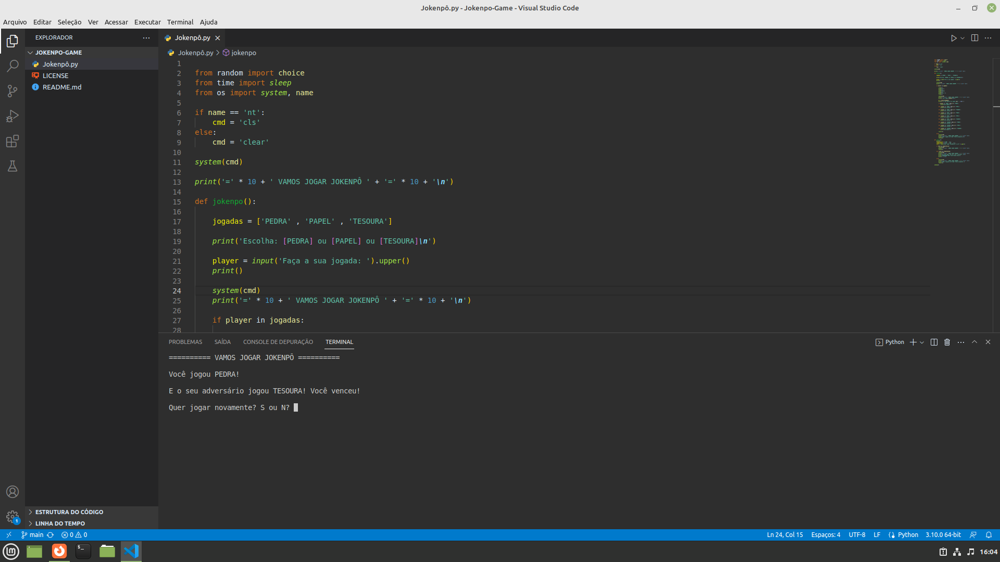

# Jokenpô em Python
Este é uma implementação simples do jogo de pedra, papel e tesoura, conhecido como "Jokenpô" em algumas regiões. Você pode jogar contra o computador e desfrutar de uma experiência de jogo clássica. 🎮

## Como Jogar
1. Execute o script em Python no seu terminal ou prompt de comando.
2. Você será solicitado a escolher entre: 'PEDRA', 'PAPEL' ou 'TESOURA' (insensível a maiúsculas e minúsculas).
3. O computador selecionará aleatoriamente a sua escolha.
4. O resultado do jogo será exibido, mostrando se você ganhou, perdeu ou se é um empate. 🏆
5. Você pode escolher jogar novamente ou sair do jogo.

## Regras
- PEDRA vence TESOURA
- TESOURA vence PAPEL
- PAPEL vence PEDRA

## Requisitos
- Python 3.x

## Como Executar
1. Salve o código em um arquivo Python (por exemplo, `jokenpo.py`).
2. Abra o seu terminal ou prompt de comando.
3. Navegue até o diretório que contém o arquivo `jokenpo.py`.
4. Execute o script digitando `python jokenpo.py`. ▶️

- Divirta-se jogando Jokenpô!
